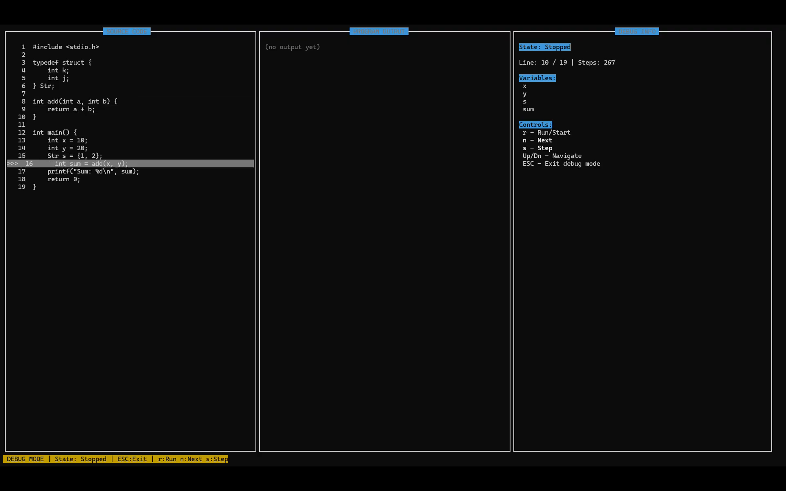

# 디버거 사용 가이드

## 목차
1. [디버거 시작하기](#디버거-시작하기)
2. [기본 조작법](#기본-조작법)
3. [디버깅 명령어](#디버깅-명령어)
4. [화면 구성](#화면-구성)
5. [실전 예제](#실전-예제)
6. [문제 해결](#문제-해결)

---

## 디버거 시작하기

### 1. C 프로그램 준비

디버깅할 C 소스 파일을 작성합니다:

```c
// example.c
#include <stdio.h>

int add(int a, int b) {
    return a + b;
}

int main() {
    int x = 10;
    int y = 20;
    int sum = add(x, y);
    printf("Sum: %d\n", sum);
    return 0;
}
```

### 2. 파일 브라우저 실행

```bash
./filebrowser
```

### 3. 디버그 모드 진입

1. 화살표 키(↑/↓)로 C 파일 선택 (예: `example.c`)
2. `d` 키 입력
3. 자동 컴파일 진행 (`gcc -g -o example example.c`)
4. 컴파일 성공 시 디버그 모드로 전환

**컴파일 실패 시:**
- 우측 패널에 에러 메시지 표시
- ESC로 확인 후 소스 수정
- `v` 키로 vim 편집 가능

---

## 기본 조작법

### 화면 이동
- `↑` / `↓` : 소스 코드 한 줄씩 이동
- `Page Up` / `Page Down` : 10줄씩 스크롤
- 자동 스크롤: 실행 중 현재 라인이 자동으로 화면에 표시됨

### 모드 전환
- `ESC` : 디버그 모드 종료 → 파일 브라우저로 복귀

---

## 디버깅 명령어

### 프로그램 제어

#### `r` - Run/Start (프로그램 시작)
- 프로그램을 처음부터 실행
- 디버거가 프로세스를 생성하고 추적 시작
- 첫 번째 명령어에서 멈춤

**사용 시점:**
- 디버그 모드 진입 직후
- 프로그램이 종료된 후 재시작

**예시:**
```
1. 디버그 모드 진입
2. 'r' 키 입력 → 프로그램 시작
3. State: Stopped (첫 라인에서 정지)
```

#### `n` - Next (다음 줄 실행 / Step Over)
- 현재 라인을 실행하고 다음 라인으로 이동
- 함수 호출 시 함수 내부로 들어가지 않고 건너뜀
- 함수 전체가 실행되고 다음 라인으로 이동

**사용 시점:**
- 함수 내부를 보지 않고 빠르게 진행하고 싶을 때
- 라이브러리 함수 호출을 건너뛸 때

**예시:**
```c
int main() {
    int x = 10;        // 현재 위치 (>)
    int y = 20;        // 'n' 입력 후 여기로 이동
    int sum = add(x, y);  // 'n' 입력 시 add() 함수 전체 실행 후 다음으로
    printf(...);
}
```

#### `s` - Step (한 줄 실행 / Step Into)
- 현재 라인을 실행하고 다음 라인으로 이동
- 함수 호출 시 함수 내부로 진입
- 함수의 첫 번째 라인에서 정지

**사용 시점:**
- 함수 내부 동작을 자세히 확인하고 싶을 때
- 버그가 함수 내부에 있을 때

**예시:**
```c
int main() {
    int sum = add(x, y);  // 현재 위치 (>) - 's' 입력
    // ↓ add() 함수 내부로 진입
}

int add(int a, int b) {
    return a + b;  // 여기서 정지
}
```

#### `c` - Continue (계속 실행)
- 다음 브레이크포인트까지 실행
- 브레이크포인트가 없으면 프로그램 끝까지 실행
- 프로그램이 종료되면 State: Exited

**사용 시점:**
- 특정 지점까지 빠르게 이동하고 싶을 때
- 브레이크포인트를 설정한 후 그곳까지 실행

**예시:**
```c
int main() {
    int x = 10;        // 현재 위치
    int y = 20;
    int sum = add(x, y);  // ← 브레이크포인트 (•)
    printf(...);       // 'c' 입력 시 브레이크포인트까지 실행
}
```

---

**화면 표시:**
```
   1  int main() {
   2      int x = 10;
   •3      int y = 20;        ← 브레이크포인트
   >4      int sum = add(x, y);  ← 현재 실행 위치
   5      return 0;
```

---

## 화면 구성




### 좌측 패널 - 소스 코드
- **라인 번호**: 각 라인 앞에 표시
- **`>`**: 현재 실행 중인 라인
- **하이라이트**: 현재 라인은 반전 색상으로 강조

### 우측 패널 - 디버그 정보

#### State (상태)
- `Not Started`: 프로그램 시작 전
- `Stopped`: 정지 상태 (명령 입력 대기)
- `Step`: 한 줄 실행 후 정지
- `Breakpoint`: 브레이크포인트에서 정지
- `Running`: 실행 중
- `Exited`: 프로그램 종료

#### Line (현재 라인)
- 현재 실행 위치 / 전체 라인 수

#### Controls (조작 안내)
- 현재 상태에서 사용 가능한 명령어 표시
- 볼드: 사용 가능한 명령
- 흐림: 사용 불가능한 명령

---

## 실전 예제

### 예제 1: 간단한 디버깅

```c
// simple.c
#include <stdio.h>

int main() {
    int x = 10;
    int y = 20;
    int sum = x + y;
    printf("Sum: %d\n", sum);
    return 0;
}
```

**디버깅 순서:**
1. `./filebrowser` 실행
2. `simple.c` 선택 → `d` 키
3. `r` 키 → 프로그램 시작
4. `n` 키 3번 → `sum` 계산까지 실행
5. 우측 패널에서 레지스터 값 확인
6. `n` 키 → printf 실행
7. `n` 키 → return 실행 (프로그램 종료)
8. `ESC` → 파일 브라우저로 복귀

### 예제 2: 함수 내부 디버깅

```c
// function.c
#include <stdio.h>

int add(int a, int b) {
    int result = a + b;
    return result;
}

int main() {
    int x = 10;
    int y = 20;
    int sum = add(x, y);
    printf("Sum: %d\n", sum);
    return 0;
}
```

```c
// loop.c
#include <stdio.h>

int main() {
    for (int i = 0; i < 5; i++) {
        printf("i = %d\n", i);
    }
    printf("Done!\n");
    return 0;
}
```

---

## 문제 해결

### Q: 컴파일이 실패합니다
**A:** 우측 패널에 에러 메시지가 표시됩니다
- ESC로 에러 확인
- 소스 파일로 돌아가서 `v` 키로 vim 편집
- 수정 후 다시 `d` 키로 디버그 시작

### Q: 'n' 키를 눌러도 반응이 없습니다
**A:** 프로그램 상태 확인
- State가 "Not Started"면 먼저 `r` 키로 시작
- State가 "Exited"면 프로그램이 종료됨 → `r` 키로 재시작

### Q: 화면이 깨집니다
**A:** 터미널 크기 조정
- 최소 80x24 크기 권장
- 터미널 크기 변경 후 ESC → `d` 키로 재진입

### Q: 함수 내부로 들어가지 않습니다
**A:** 현재 구현의 제한사항
- `s`와 `n`이 동일하게 동작
- 함수 심볼 정보 파싱 미구현
- 개선 예정 기능

---

## 현재 구현 상태

### 구현된 기능
- 프로그램 실행 제어 (r, n, s, c)
- 한 줄씩 실행
- 자동 컴파일

### 개선 예정
- 변수 값 표시 (DWARF 파싱)
- 실제 브레이크포인트 적용
- 스택 트레이스
- 함수 심볼 인식
- Step Over/Into 구분

---