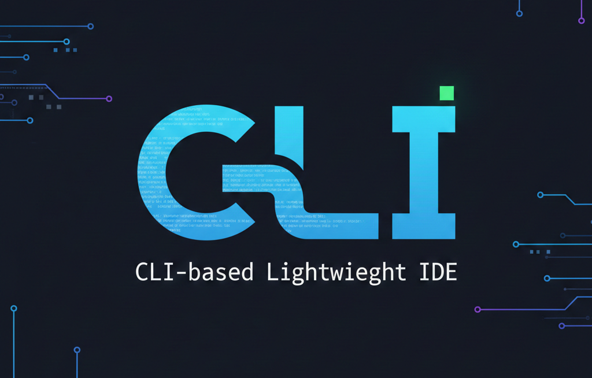

# CLI-based Lightweight IDE

ncurses and ptrace를 사용한 터미널 기반 IDE 구현.

## Features

### File Browser
- 마우스와 키보드로 지원하는 디렉터리 탐색
- 파일 미리보기 및 편집 지원
- 현재 디렉터리에서 쉘 명령어 지원.
- 빠른 편집을 위한 Vim intergration.

### Interactive Debugger
- Step-by-step 실행 of C 소스드드
- 실시간 실행 중인 코드 라인 표시
- pipe를 활용한 실시간 실행 캡처 후 출력
- 레지스터 상태 추적 (내부 구현)
- 디버깅 심볼을 활용한 자동 디버깅 기능 (-no-pie, -g)
- 명령어 단위 실행 (내부 구현)
- addr2line을 사용한 소스라인 매핑

### User Interface
- 3분할 레이아웃 (files, code, controls)
- 반응형 터미널 레이아웃
- 마우스 입력 지원
- 모든 동작의 키보드 입력 할당

## Requirements

- Linux operating system
- GCC compiler
- ncurses library
- addr2line utility (usually included with binutils)

## Build

```bash
make
```

Clean build:
```bash
make clean && make
```

## Run

```bash
./filebrowser
```

## Usage

### File Browser Mode

**Navigation:**
- `↑` / `↓` : Navigate files and directories
- `Enter` : Open directory or preview file
- `Page Up` / `Page Down` : Scroll through file preview
- `Mouse Click` : Select files and directories

**Commands:**
- `v` : Open current file in Vim
- `:` : Enter command mode (execute shell commands)
- `d` : Debug C source file (compile and enter debug mode)
- `q` : Quit application

### Debug Mode

**Starting a Debug Session:**
1. Select a `.c` file in the file browser
2. Press `d` to compile and enter debug mode
3. If compilation succeeds, debugger starts automatically and status changes Not started to Stopped.
4. If compilation fails, errors are shown in the output panel

**Debug Commands:**
- `r` : Run/Restart program (starts from beginning)
- `n` : Next (execute current line, step over functions)
- `↑` / `↓` : Scroll through source code
- `Page Up` / `Page Down` : Scroll 10 lines
- `ESC` : Exit debug mode

**Debug Panel Layout:**
- **Left Panel**: Source code with line numbers and current position marker (`>>>`)
- **Middle Panel**: Program output (stdout/stderr)
- **Right Panel**: Debug information (state, line number, controls)

## Example Programs

The `examples/` directory contains sample programs for testing debugging tools:

| File | Description |
|------|-------------|
| `01_simple.c` | Basic Hello World |
| `02_variables.c` | Variable operations |
| `03_loop.c` | Loop iteration |
| `04_function.c` | Function calls |
| `05_recursive.c` | Recursive factorial |
| `06_array.c` | Array manipulation |
| `07_pointer.c` | Pointer usage |
| `08_conditional.c` | If-else statements |
| `09_fibonacci.c` | Fibonacci sequence |
| `10_struct.c` | Structure usage |

### Quick Test

```bash
./filebrowser
# Navigate to examples/
# Select 02_variables.c
# Press 'd' to debug
# Press 'r' to run
# Press 'n' to step through each line
# Watch variables change in output
```

## How It Works

### Debugging Engine
- Uses `ptrace` system call to control child process execution
- Forks debugged program and traces it with `PTRACE_TRACEME`
- Captures stdout/stderr through pipes
- Maps instruction addresses to source lines using persistent `addr2line` process
- Single-steps through instructions until source line changes

### Compilation
Programs are compiled with:
```bash
gcc -g -O0 -no-pie -o <executable> <source.c>
```
- `-g`: Include debug symbols (DWARF format)
- `-O0`: Disable optimizations (easier debugging)
- `-no-pie`: Disable position-independent executable (simpler address mapping)

## Architecture

```
main.c              - Main application loop and UI coordination
filemanager.c       - Directory navigation and file listing
code_view.c         - Source code preview panel
control_panel.c     - Command input and execution
debugger.c          - Core debugging logic (ptrace, process control)
debug_view.c        - Debug mode UI
ui_helpers.c        - Common UI utilities
```

## Limitations & Future Improvements

### Current Limitations
- `step` and `next` commands behave identically (no function symbol recognition)
- No breakpoint support yet
- No variable inspection (DWARF parsing not implemented)
- No call stack display
- Limited to x86-64 architecture

### Planned Features
- [ ] Variable viewer with DWARF parsing
- [ ] Breakpoint support (`b` command)
- [ ] Call stack / backtrace
- [ ] Step into vs step over distinction
- [ ] Memory viewer
- [ ] Watch expressions
- [ ] Multi-threaded program support

## Troubleshooting

**Compilation errors:**
- Check that file has no syntax errors
- Errors are displayed in the output panel
- Press ESC to return to file browser and edit with `v`

**Program doesn't start:**
- Make sure to press `r` after entering debug mode
- Check DEBUG INFO panel for current state

**Screen corruption:**
- Resize terminal to at least 80x24
- Press ESC and re-enter debug mode with `d`

**Output not showing:**
- Output appears in the middle panel
- Make sure program has printf statements
- Some buffered output may appear late

## License

This is a student project for System Programming course KNU-ELEC462 (2025 Fall Semester).

## Credits

Built with:
- ncurses for terminal UI
- ptrace for process debugging
- addr2line for address-to-line mapping

## DEMO video

[]
(https://youtu.be/Fzj9o_Z_4v0)

